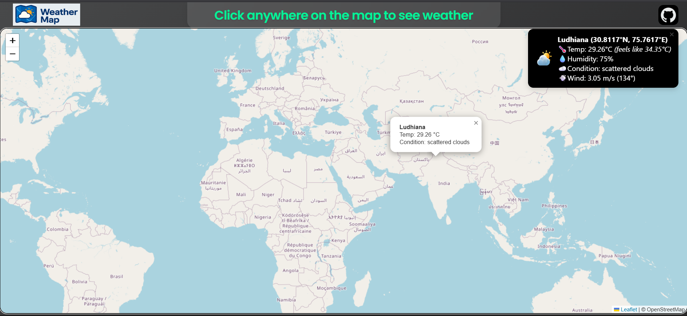

#  Weather Map App 

An interactive weather application that displays real-time weather information on a map.  
Built with **Leaflet.js** for mapping, **FastAPI** as the backend, and powered by the **Open-Meteo API** for live weather data.

Live Demo: https://pkala-weather-app.vercel.app (The app might be slow for the first few clicks as the backend takes a moment to wake up)

---

## Features
-  Fetches **current weather conditions** (temperature, humidity, wind, etc.) using the Open-Meteo API.  
-  **No API key required** - completely free weather data!
-  Displays weather info in **popups** on a Leaflet map.  
-  Click on any location to see its weather details.  
-  Centered and responsive map layout.  
-  Custom font support (e.g., *Brush Script MT*).  
-  CORS-enabled FastAPI backend for smooth frontend–backend communication.  

---

## Tech Stack
- **Frontend:** HTML, CSS, JavaScript, [Leaflet.js](https://leafletjs.com/)  
- **Backend:** [FastAPI](https://fastapi.tiangolo.com/)  
- **Weather Data Provider:** [Open-Meteo API](https://open-meteo.com/) (Free, No API Key Required!)  
- **Geocoding:** [OpenStreetMap Nominatim](https://nominatim.org/)  
- **Deployment:** [Fly.io](https://fly.io/), [Vercel](https://vercel.com/)

---

## How It Works
1. The **frontend (Leaflet map)** lets users click anywhere on the map.  
2. The **backend (FastAPI)** receives the latitude and longitude.  
3. The backend queries the **Open-Meteo API** with those coordinates (no API key needed!).  
4. The backend also uses **OpenStreetMap Nominatim** to get the location name.  
5. The response (temperature, condition, location, etc.) is sent back to the frontend.  
6. A popup is displayed at the clicked location with the weather details.  

**Note:** Open-Meteo is completely free and requires no API key or registration!

---

## 🚀 Deployment

### AWS Deployment (Recommended)

See **[QUICK_START_AWS.md](./QUICK_START_AWS.md)** for one-command deployment!

Or follow the detailed guide: **[AWS_DEPLOYMENT_GUIDE.md](./AWS_DEPLOYMENT_GUIDE.md)**

---

## 💻 Run Locally

For detailed local setup instructions, see **[SETUP_INSTRUCTIONS.md](./SETUP_INSTRUCTIONS.md)**

### Quick Start

1. **Clone the Repository**
```bash
git clone https://github.com/Siddharthh39/weahterApp.git
cd weahterApp
```

2. **Set Up Backend**
```bash
# Create virtual environment
cd backend
python3 -m venv venv
source venv/bin/activate  # On Windows: venv\Scripts\activate

# Install dependencies
pip install -r requirements.txt

# Run the backend
uvicorn app:app --reload --host 0.0.0.0 --port 8000
```

3. **Open Frontend**
   - Open `frontend/index.html` in your browser
   - Click anywhere on the map to see weather data!

**Note:** The app automatically detects if you're running locally and uses `http://localhost:8000` for the API. No API keys or registration required!

---

## Check It Out 👇



---